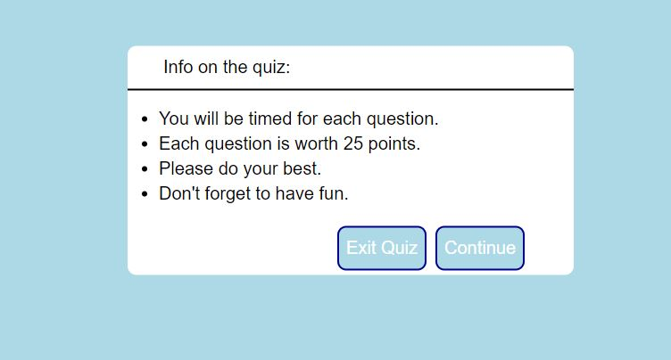

# JavaScript Quiz

This is my JavaScript quiz, intended to be a quiz that tests your knowledge of javascript. 

## Usage

With each question, there is supposed to be a 30 second timer which is currently not working. When you click on a correct answer, the text is supposed to turn green. When you click on a wrong answer, the text is supposed to turn red. When you click the next button, the array is supposed to be called to cycle through the next questions in the array of questions. 

## Contributions

Mike Horvath 2021

## Screenshot

